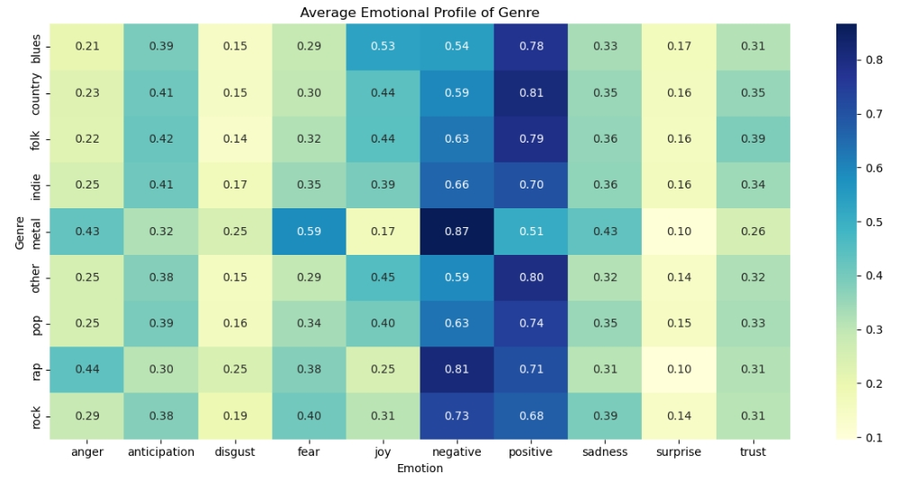

# lyrics-genre-emotion-analysis
An exploratory data analysis of song lyrics across various genres using various tools and methods (python, sentiment analysis, data visualization, Emolex).
This project primarily serves as a way for me to learn how to approach data analysis projects from start to finish by building my own data pipelines.

## Motivations:
This project was inspired principally by two things. Firstly, pure curiosity! I was curious to take data I had about my own personal collection of music and use it to make comparisons with data about music generally. As someone who, apart from streaming music, also maintains a collection of music in physical media formats (CDs and vinyl records), I was interested to know if I could use data as a way to build insight into how, if at all, the music represented in the different formats I use (streaming, CDs, Vinyl) might show themselves to embody different “profiles” related to the format I collect them on. In other words, is there something about the content that I collect in the format of CDs that has aspects that are different from those of music that I collect on vinyl or that I stream? Certainly, to my mind, there are. I am aware of conscious reasons I can give as to why I might collect one album in one format and a different one in a different format. But can I use data to better understand these reasons?
Secondly, the motivation for this project stems from a desire simply to better understand working with data as a tool for analysis. I am quite simply interested in learning how one goes about turning large amounts of data into actual insight. Taking on this project seemed to me a perfect opportunity to get some real firsthand experience with understanding data pipelines from start to finish, from forming an idea/question, to locating relevant data, to exploring and cleaning that data, to analyzing and turning it into human readable mediums. What is accomplished and detailed here in this report is of course just a start to the larger project outlined in the paragraph above. But more so, in the context of what is presented here in this report, it is a showcase of my attempt to better understand and learn to use these tools.

## Datasets Used:
- “Song lyrics from 79 musical genres”: A large collection of lyrical data from a wide range of songs including other data like genre and artist. Link: [https://www.kaggle.com/datasets/neisse/scrapped-lyrics-from-6-genres?select=lyrics-data.csv]
- “Spotify Million Song Dataset”: A dataset containing songs, their metadata, and lyrics sourced from Spotify. Link: [https://www.kaggle.com/datasets/notshrirang/spotify-million-song-dataset]
- “Genius Song Lyrics”a: A dataset containing songs, their lyrics, and some metadata sourced from Genius.com. Link: [https://www.kaggle.com/datasets/carlosgdcj/genius-song-lyrics-with-language-information]

## Methodology:
 - Combined and cleaned multiple publically available datasets (~3.4 million rows)
 - Intergrated the Emolex lexicon as a way to perform sentiment analysis on lyrical data. (https://saifmohammad.com/WebPages/NRC-Emotion-Lexicon.htm)
 - Tokenized and scored lyrical content, and normalized scores across songs
 - Visualized the results using a heatmap made using Seaborn

## Key Results
This heatmap which shows the average emotional scores per genre, revealing differences in the average emotional profile of each genre. While not meant to be taken as any kind of conclusive evidence of the emotional content of these (or any other) genres of music, this heatmap does show a good proof of concept for how the lyrics of songs can be used as a means for understanding such content. With this established, a next good step will include finding and throughoughly cleaning different data to ensure that each genre inspected is equally represented in the data. This was a step regretably not taken for the sake of expediancy in getting to the proof of concept here.

## License
MIT License
